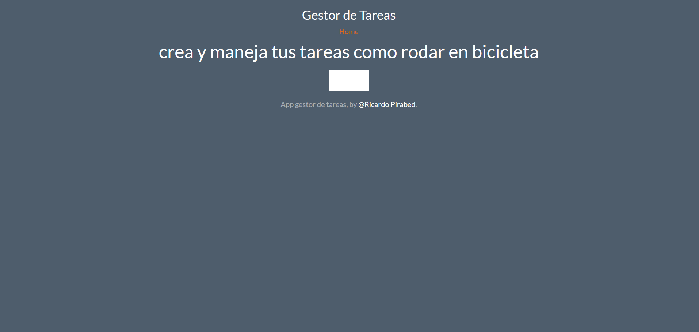
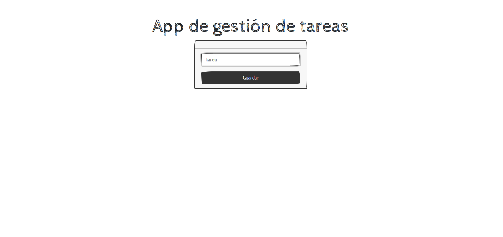
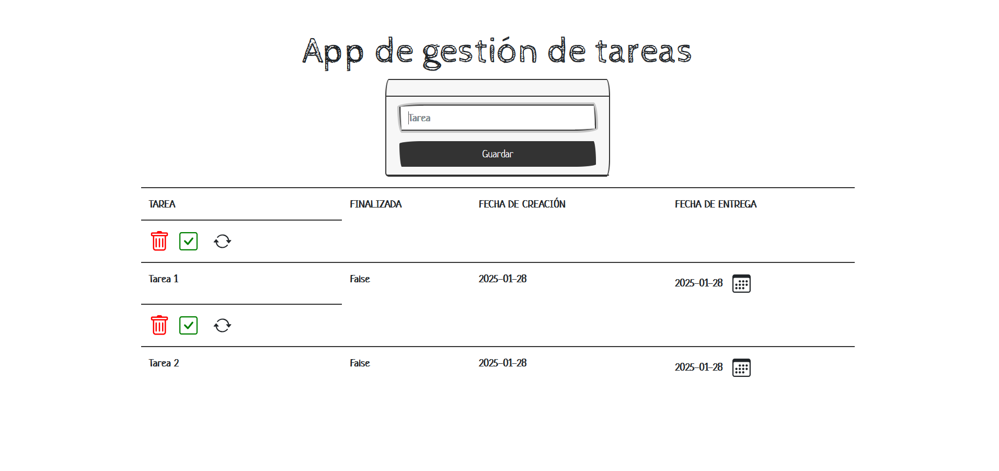

# Project Title: FlaskTasksManager

This is a basic web aplication created with Python and Flask to manage tasks. 

Use this mini project to learn the basic steps web app creation using Python and Flask.

1- Create an environment:

## using Conda

    conda create --name flask_env --file requirements.txt

## using pip

    pip install -r requirements.txt

2- Run core/main.py

    python main.py

3- Screeshots

    
    
    

